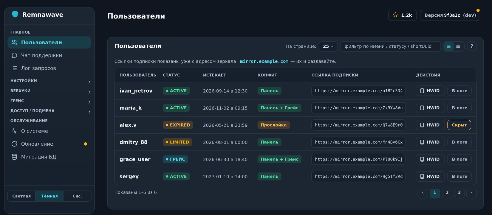
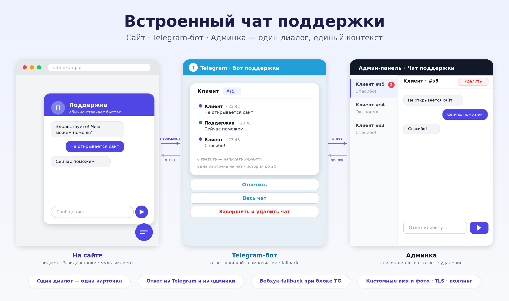

# Remnawave Subscription Middleware



💬 **Чат проекта:** https://t.me/+GTkYbwX3alg0ZGEy

> [!CAUTION]
> **Проект в стадии тестирования.** Возможны ошибки и нестабильное поведение.
> Используйте на свой риск: делайте бэкап БД панели и прослойки, сначала
> проверяйте на тестовом пользователе / тестовой панели. Особое внимание —
> функция «грейс-сквад»: она пишет в живую панель (см. раздел «Может ли прослойка
> навредить» ниже).

Прослойка-зеркало для подписок [Remnawave](https://remna.st): принимает запрос
подписки на своём (РФ) домене, проксирует его на origin-домен панели и на лету
правит выдачу — заголовки приложений, заглушки для заблокированных по HWID
устройств, мягкое истечение через «грейс-сквад». Плюс веб-админка поверх API
панели и пересылка вебхуков на несколько адресов.

Работает в двух режимах: **зеркало** (проксирует origin-домен подписки панели — основной РФ-сценарий) и **основная подписка** (sub-сервис панели: сама отдаёт конфиги с `/api/sub` и рендерит страницу подписки). Ставится **Docker-контейнером рядом с панелью** или **файлами на отдельном сервере**.

---

## Содержание

- [Зачем это нужно](#зачем-это-нужно)
- [Возможности](#возможности)
- [Что прослойка добавляет (удобства на стороне зеркала)](#что-прослойка-добавляет-удобства-на-стороне-зеркала)
- [Установка](#установка)
- [Установка на шаред-хостинг (FastPanel и другие панели)](#установка-на-шаред-хостинг-fastpanel-и-другие-панели)
- [О скрипте установки (стек и ресурсы)](#о-скрипте-установки-стек-и-ресурсы)
- [SQLite или MySQL/MariaDB — что выбрать](#sqlite-или-mysqlmariadb--что-выбрать)
- [Смена БД на лету (SQLite ↔ MySQL)](#смена-бд-на-лету-sqlite--mysql)
- [Обновление прослойки](#обновление-прослойки)
- [Может ли прослойка навредить панели и пользователям (честно, из кода)](#может-ли-прослойка-навредить-панели-и-пользователям-честно-из-кода)
- [Чего в скрипте/прослойке нет (пока)](#чего-в-скриптепрослойке-нет-пока)
- [Требования](#требования)
- [Структура](#структура)

---

## Зачем это нужно

Панель Remnawave обычно живёт на зарубежном origin за Cloudflare. Из России
такой адрес часто открывается нестабильно, и **подписки у клиентов перестают
обновляться** — приложение не может достучаться до origin. Прослойка решает это:
клиент ходит на РФ-зеркало, а уже зеркало со своей стороны проксирует запрос на
origin (часто доступный с сервера, даже если у клиента он заблокирован).

Попутно прослойка добавляет удобства на стороне зеркала: точечную блокировку
устройств с понятным сообщением, «грейс» вместо жёсткого отключения,
переопределение заголовков под конкретные клиенты и единое окно для саппорта.

---

## Возможности

- **Зеркало подписок** — проксирование запросов подписки с РФ-домена на origin
  панели. Надёжное обновление подписок у клиентов из России.
- **Грейс-сквад для истёкших** — по вебхуку `user.expired` юзер не просто
  отключается, а переносится в ограниченный сквад панели (например only-Telegram)
  с лимитом трафика/устройств на заданный срок. Исходные сквады, лимит, стратегия
  трафика, лимит HWID и дата сохраняются; при заходе в грейс израсходованный трафик
  сбрасывается (если задан грейс-лимит) — чтобы юзер не попал сразу в LIMITED. При
  оплате — возврат всего на место с **коррекцией даты «от сегодня»**; по окончании
  грейса — обычное истечение с восстановлением **реальной исходной даты**.
- **HWID-блокировка устройств** — точечная блокировка конкретного устройства по
  его HWID: оно перестаёт получать рабочий конфиг и видит заглушку с вашим текстом
  (для base64- и clash-клиентов). Просмотр и удаление устройств юзера прямо из
  админки.
- **Правила ответа по приложению (Response Rules)** — таргетированная подмена
  HTTP-заголовков подписки под конкретный клиент по `user-agent` и `x-device-os`
  (profile-title, announce, интервал обновления, Provider ID для Happ, тема
  FlClashX, настройки koala и т.д.). Правило «Все клиенты» уходит всем, правила под
  приложение добавляются поверх; есть проверка по User-Agent. Кириллица кодируется
  в base64 автоматически, критичные служебные заголовки защищены.
- **Проброс доп. конфигов по сквадам (бета).** В выдачу подписки можно добавлять
  дополнительные конфиги (WireGuard / AmneziaWG) по внутреннему скваду пользователя:
  один конфиг привязывается к нескольким сквадам, а формат доставки подстраивается
  под клиент (Xray / sing-box / Mihomo / Throne — схема `wg://` или `wireguard://`
  выбирается по телу подписки и User-Agent). VLESS-узлы добавляются ссылкой
  `vless://` и отдаются как base64/JSON или Clash. **Функция в бета-тесте:**
  поведение в разных клиентах ещё обкатывается — включайте и проверяйте на тестовом
  пользователе.
- **Слияние двух подписок.** Узлы второй подписки подмешиваются в тело основной —
  клиент получает одну ссылку, а серверы из обеих подписок лежат вместе под общими
  группами. Вторая подписка — отдельный пользователь панели со своим лимитом
  трафика, поэтому лимит на доп-серверы независим от основного. Подмешивание идёт,
  только пока основная подписка активна (истекла/заблокирована — узлы второй
  пропадают сами); при исчерпании трафика второй вместо её узлов подставляется
  строка-заглушка. Привязка — авто по суффиксу имени (`tg_<id>` → `tg_<id>_addsub`,
  ищется через API панели) или вручную кнопкой «+» во вкладке «Пользователи» по
  адресу второй подписки. Работает для base64 / Clash / sing-box; вливание в
  xray-json — опционально.
- **Обновление с GitHub** — встроенное обновление прослойки по коммитам: раз в
  сутки проверяет ветку, тянет только изменённые файлы, делает бэкап с откатом.
  Пункт меню «Обновление» подсвечивается, когда есть что обновить.
- **Пересылка вебхуков (тройник)** — входящий вебхук панели можно разослать на
  несколько ваших адресов, переподписав каждого его собственным секретом (или
  переслать уже после обработки прослойкой).
- **Веб-админка** поверх API панели: список пользователей со ссылками подписки
  через зеркало, устройства HWID, ручные оверрайды, логи (запросов, вебхуков,
  пересылки, грейс-юзеров), брендинг.
- **Брендинг автоматически** подтягивается из панели (имя и логотип), с ручным
  переопределением при необходимости.
- **Маскировка с выбором дизайна** — на не-подписочные запросы отдаётся нейтральная
  страница входа «личного кабинета» (а не голый прокси); её вид выбирается из
  нескольких готовых дизайнов в разделе «Брендинг».
- **Чат поддержки на странице-заглушке** — встроенный чат с переотправкой сообщений
  в Telegram (отдельный бот) и двусторонним вебхук-fallback на случай блокировки TG.
  Оператор отвечает из админки, из Telegram или через вебхук. Диалог (и запись с IP)
  заводится только когда посетитель реально написал — обычные заходы и краулеры чат
  не создают.
- **Мониторинг нагрузки** — вкладка «О системе»: версия PHP/ОС/БД, график запросов
  с разделением реальных обновлений подписки и краулеров/сканеров, детектор
  аномальных пиков нагрузки.



---

## Что прослойка добавляет (удобства на стороне зеркала)

Прослойка не заменяет панель и не «лучше» её — она стоит **перед** панелью и берёт
на себя то, что удобнее делать на стороне РФ-зеркала. Это субъективные удобства:

- **Доступ из РФ.** Origin-домен панели из России часто открывается нестабильно
  (заграница / Cloudflare). Клиент ходит на РФ-зеркало, а оно само проксирует запрос
  на origin — подписки обновляются надёжнее.
- **Мягкое истечение (грейс-сквад).** Можно автоматически переносить истёкшего в
  ограниченный сквад на грейс-период и возвращать обратно при оплате (с коррекцией
  даты) — удобно, если не хочется «отрубать сразу».
- **Точечная блокировка по HWID.** Заблокировать конкретное устройство по его HWID и
  показать ему свой текст-заглушку — удобно для модерации отдельных устройств.
- **Свой текст для заблокированных / грейс-юзеров** прямо в выдаваемом конфиге.
- **Правила ответа по приложению** — подмена заголовков подписки под конкретный
  клиент (по User-Agent/ОС) на стороне зеркала, не трогая панель.
- **Доп. конфиги по сквадам (бета).** Подмешать в подписку дополнительный
  WG/AWG-конфиг по внутреннему скваду пользователя, с подстройкой формата под
  клиент. Функция пока в бета-тесте.
- **Пересылка вебхука с разными секретами.** Панель умеет слать хук на несколько URL,
  но всем — одним секретом; прослойка может переподписать каждого адресата его
  секретом и/или переслать после своей обработки.
- **Чат с клиентом на странице-заглушке** — встроенный чат без сторонних виджетов;
  сообщения дублируются в Telegram (отдельный бот) и/или на вебхук, ответить можно
  из админки, Telegram или вебхуком.
- **Единое операционное окно** — пользователи, устройства, оверрайды и логи в одной
  админке зеркала.

---

## Установка

`install.sh` при запуске предлагает два пути:

1. **Рядом с панелью, Docker (рекомендуется)** — прослойка-контейнер из готового образа встаёт перед контейнером `subscription-page` панели: добавляет свои фичи на клиентском пути, а страницу подписки в браузере проксирует на него. Обновление — `docker compose pull`.
2. **Отдельный сервер (файлами)** — классическое зеркало: nginx + PHP-FPM + TLS на своём РФ-домене, проксирование origin-домена подписки.

> 📘 **Пошаговая инструкция по обоим вариантам — [INSTALL.md](INSTALL.md):** Docker-установка рядом с панелью (правка nginx панели, перевод домена подписки на прослойку) и установка на отдельный сервер. На эту же страницу ссылается вывод `install.sh`.

### Вариант 1. Рядом с панелью (Docker)

Панель и её reverse-proxy уже работают, домен подписки обслуживает контейнер `subscription-page`. Прослойка встаёт **перед** ним:

```bash
sudo apt update && sudo apt install -y git
sudo git clone https://github.com/Mrvibecodic/remnawave-subscription-middleware \
    /opt/remnawave-subscription-middleware
cd /opt/remnawave-subscription-middleware
sudo bash install.sh        # выбрать «2) Рядом с панелью — Docker»
```

Установщик спросит домен подписки, имя docker-сети панели, внутренние URL панели и контейнера `subscription-page`, тег образа (`latest` — стабильный, или `dev` — тестовый; см. [docs/docker-image-tag.md](docs/docker-image-tag.md)), создаст `docker-compose.yml`, скачает образ из GHCR и поднимет контейнер. Останется одной строкой в nginx панели перевести домен подписки с контейнера `subscription-page` на прослойку — все шаги в **[INSTALL.md](INSTALL.md)**. Контейнер `subscription-page` останавливать не нужно; данные (`config.php`, БД) живут в volume и переживают `docker pull`.

### Вариант 2. Отдельный сервер (файлами)

На чистом **РФ-сервере** (Ubuntu 22.04+/Debian 12+) ставится **актуальный nginx (из официального репозитория nginx.org) +
PHP-FPM + SQLite** (по умолчанию; опционально MySQL/MariaDB). Клонируйте репозиторий в `/opt` и запустите
установщик:

```bash
sudo apt update && sudo apt install -y git
sudo git clone https://github.com/Mrvibecodic/remnawave-subscription-middleware \
    /opt/remnawave-subscription-middleware
cd /opt/remnawave-subscription-middleware
sudo bash install.sh        # выбрать «1) Отдельный сервер»
```

На минимальных образах Ubuntu/Debian git не предустановлен — первая строка ставит
его. Папку создавать не нужно — `git clone` создаёт её сам; `sudo` обязателен,
потому что запись в `/opt` доступна только root.

Установщик сам:

- доставит зависимости, если их нет (актуальный nginx из nginx.org, php-fpm, php-sqlite3, php-mysql, certbot);
- создаст БД (SQLite-файл или MariaDB — по выбору);
- развернёт файлы в `/opt/remnawave-subscription-middleware`;
- выпустит TLS-сертификат;
- пропишет **полный конфиг nginx**: вебхук `/webhook.php`, фронт-контроллер для
  подписок, отдачу статики, редирект 80→443 и закрытие служебных файлов
  (`config.php`, `lib/`, `schema.sql` и т.п.) — всё прямо в nginx, потому что на
  чистом nginx `.htaccess` не работает.

Скрипт спросит:

- **домен прослойки** — он же домен зеркала подписок (один домен);
- **origin-домен** подписки панели (напр. `sub.example.com`);
- **тип БД**: SQLite (по умолчанию — ничего не ставится) или MySQL/MariaDB
  (установщик сам поставит лёгкую MariaDB и создаст базу со случайными именем,
  пользователем и паролем);
- **способ выпуска сертификата** на выбор:
  - **HTTP-01** — валидация по 80 порту (порт должен быть открыт извне);
  - **Cloudflare DNS API** — без открытия портов (на выбор: API Token с правами Zone.DNS: Edit, либо Global API Key + email аккаунта);
- e-mail для Let's Encrypt.

Домены и параметры БД установщик кладёт во временный `data/install.json`, и
PHP-мастер подставляет их сам — повторно вводить не нужно (после установки файл
удаляется).

После установки откройте `https://<домен>/admin/`, пройдите мастер (данные БД
печатает установщик), задайте URL панели + API-токен и секрет вебхука, затем
пропишите `https://<домен>/webhook.php` в `.env` панели Remnawave.

### Сертификат

Один домен — один сертификат, без wildcard. Способ на выбор при установке:
HTTP-01 (`certbot --webroot`, по 80 порту) либо Cloudflare DNS
(`certbot --dns-cloudflare`, без открытия портов). Автопродление настраивает сам
certbot (systemd-таймер); при продлении сертификата nginx автоматически
перезагружается, чтобы подхватить новый (`--deploy-hook "systemctl reload nginx"`).

## Установка на шаред-хостинг (FastPanel и другие панели)

`install.sh` рассчитан на отдельный VPS, но сама прослойка — обычное PHP-приложение
без демонов и cron: она работает и на шаред-хостинге или сервере с панелью
управления (FastPanel, ISPmanager, Hestia, aaPanel, cPanel и т.п.). Связка
Apache + PHP в режиме cgi-fcgi поддерживается штатно — php-fpm не обязателен.

**Что нужно от хостинга:**

- PHP 8.1+ с расширениями `pdo_sqlite` (или `pdo_mysql`), `curl`, `mbstring`;
- Apache с `mod_rewrite` и поддержкой `.htaccess` — типовая схема панелей
  «nginx спереди + Apache сзади» подходит. На чистом nginx без Apache `.htaccess`
  не работает: нужны location-правила, как в `install.sh` (если панель позволяет
  добавлять свои директивы nginx);
- выпуск TLS-сертификата средствами панели (Let's Encrypt есть почти везде);
- `max_execution_time` не меньше таймаута проксирования (по умолчанию 30 сек —
  обычных 60 сек хостинга хватает с запасом).

**Шаги:**

1. В панели хостинга создайте сайт на домене зеркала и выпустите сертификат
   Let's Encrypt (включите редирект 80→443, если панель не делает это сама).
2. Залейте файлы репозитория в корень сайта: ZIP с GitHub через файловый менеджер,
   sftp или `git clone`, если git на хостинге есть. Проверьте, что скрытый
   `.htaccess` тоже загрузился — файловые менеджеры часто прячут dot-файлы.
3. Каталог `data/` и корень сайта должны быть доступны PHP на запись (на
   шаред-хостинге PHP обычно работает от владельца файлов — менять ничего не
   нужно; мастер создаст `config.php` и файл БД сам).
4. Откройте `https://<домен>/admin/` — мастер первого запуска спросит origin-домен,
   URL панели + API-токен, секрет вебхука и логин/пароль админки. БД по умолчанию —
   SQLite-файл в `data/`, для шаред-хостинга это оптимально; переехать на MySQL
   (базу создайте средствами панели) можно потом в один клик через вкладку
   «Миграция БД».
5. Пропишите `https://<домен>/webhook.php` в `.env` панели Remnawave.
6. Проверьте, что служебные пути закрыты: `https://<домен>/config.php`,
   `https://<домен>/data/` и `https://<домен>/lib/` должны отдавать 403/404
   (правила уже есть в `.htaccess`). Если они открываются — у сайта выключен
   `AllowOverride`, включите обработку `.htaccess` в настройках панели.

**Нюансы:**

- Обновление — прямо из админки («Обслуживание → Обновление»): тянутся только
  изменённые файлы с GitHub, с бэкапом и откатом. git на хостинге не нужен.
- Если панель отдаёт статику напрямую через nginx (типовая схема FastPanel) — это
  нормально: подписочные пути без расширений всё равно доходят до Apache →
  `index.php`.
- Лимиты процессов/памяти у шаред-тарифов обычно скромные — для прослойки этого
  достаточно (см. раздел про ресурсы ниже), но при плотном потоке запросов
  отдельный VPS предсказуемее.

## О скрипте установки (стек и ресурсы)

**Стек:** актуальный nginx (из nginx.org) + PHP-FPM (режим `ondemand`) + SQLite (по умолчанию) или MySQL/MariaDB. Отдельный сервер БД для SQLite не нужен.

**Потребление ресурсов (ориентир, стек по умолчанию — nginx + PHP-FPM + SQLite):**

- В простое — почти ноль: при `pm=ondemand` PHP-воркеры не висят, поднимаются
  только на запрос и гаснут после простоя. nginx + простой ≈ 30–60 МБ RAM.
- Под нагрузкой каждый одновременный запрос подписки = один PHP-воркер на время
  проксирования (пока ждём ответ origin). Дефолтных 8 воркеров с запасом хватает
  на десятки запросов/сек.
- Подходит для слабых VPS (1 vCPU / 512 МБ–1 ГБ RAM).

**Ограничения SQLite и пределы роста:**

- SQLite — файловая БД, запись сериализуется (один писатель на всю базу за раз).
  Включены `journal_mode=WAL` и `busy_timeout=5000`, поэтому читатели не блокируют
  писателя и наоборот, а конкурентные записи встают в очередь, а не падают с
  «database is locked».
- Комфортно: примерно до 1–2 тыс. пользователей и пиков в единицы–десятки запросов/сек.
- Узкое место — высокая ОДНОВРЕМЕННАЯ запись из многих воркеров (постоянный
  плотный поток). Если упрётесь: уменьшите `request_log_retention` или переходите
  на внешнюю клиент-серверную СУБД.
- Рост файла БД ограничен: лог запросов режется до `request_log_retention`
  (по умолчанию 50 000 строк), лог пересылки — до 5 000; остальные таблицы мелкие.

**Рекомендация:** установщик рассчитан на **маленький и средний прод**. Для крупного
коммерческого сервиса с постоянной плотной записью лучше внешняя СУБД и более мощный
сервер.

## SQLite или MySQL/MariaDB — что выбрать

| | SQLite (по умолчанию) | MySQL / MariaDB |
|---|---|---|
| Установка | ничего — файл, встроено в PHP | отдельный сервер БД (`apt install mariadb-server`) |
| RAM в простое | ~0 (внутри процесса PHP) | ~80–150 МБ постоянно (демон БД) |
| Одновременная запись | сериализуется: один писатель за раз (WAL смягчает) | много писателей параллельно |
| Чтение | очень быстрое | быстрое |
| Бэкап | копия файла `data/submw.sqlite` | `mysqldump` |
| Подходящая нагрузка | малый/средний сервис (ориентир — до ~1–2 тыс. юзеров) | крупный сервис, высокая плотная запись |
| Когда брать | по умолчанию: проще, легче, без зависимостей | если упёрлись в одновременную запись или большой объём |

Цифры по RAM — ориентир, зависят от настроек. Сменить базу в любой момент можно из
админки — вкладка «Миграция БД» (в обе стороны).

## Смена БД на лету (SQLite ↔ MySQL)

В админке есть вкладка **«Миграция БД»** (группа «Обслуживание»): она переносит
все таблицы из текущей базы в другую и переключает прослойку на неё — в **обе
стороны**.

- **SQLite → MySQL:** укажите параметры уже созданной MySQL-базы (создать её
  можно при установке через `install.sh`, опцию «MySQL/MariaDB», или вручную — во вкладке есть свёрнутая справка с командами установки MariaDB и создания базы) —
  данные скопируются, `config.php` переключится на MySQL.
- **MySQL → SQLite:** одной кнопкой данные переносятся обратно в файловую базу.

Перед миграцией сделайте бэкап. `config.php` обновляется автоматически.

## Обновление прослойки

Прослойка обновляется из GitHub по коммитам и поддерживает ручное обновление с
сервера.

### Через админку

Вкладка **«Обслуживание → Обновление»**:

1. При первом заходе нажмите **«Отметить текущую версию»** — зафиксируется коммит
   (`installed_commit`), с которого стоит установка. Версия видна в подвале админки
   (снизу слева).
2. Дважды в сутки (раз в 12 ч) прослойка проверяет выбранную ветку; когда появляются
   новые коммиты с реальными изменениями файлов, пункт меню **«Обновление»**
   подсвечивается, а в подвале есть кнопка **⟳ проверить**.
3. На вкладке — список новых коммитов и изменённых файлов, кнопка **«Обновить»**.
   Перед записью делается бэкап в `.backups/`, есть откат.

Тянутся только изменённые файлы. Защищены и не перезаписываются: `config.php`,
`config.example.php`, `.git`, `.backups/`. Без токена лимит GitHub API — 60 запросов
в час на IP, поэтому авто-проверка идёт раз в 12 часов; при блокировке GitHub (DPI)
будет ошибка сети — повторите позже.

### В Docker

Если прослойка установлена контейнером, обновление идёт через образ, а не файлами. На вкладке «Обновление» показаны установленная версия, ветка (тег образа) и команда:

```bash
cd /opt/remnawave        # каталог docker-compose стека панели
docker compose pull && docker compose up -d
```

Ветка = тег образа (`latest` — стабильный, `dev` — тестовый); сменить можно на той же вкладке (поправив тег в `docker-compose.yml`). **Перед обновлением проверь, какой тег стоит в compose: `docker compose pull` тянет именно его — иначе можно случайно перейти на `dev`.** Подробнее — [docs/docker-image-tag.md](docs/docker-image-tag.md). `config.php` и БД лежат в volume и при обновлении не теряются.

### Вручную с сервера

Установка склонирована из git (см. раздел «Установка») — обновляйтесь штатно:

```bash
cd /opt/remnawave-subscription-middleware
git fetch origin
git reset --hard origin/main      # config.php и data/ в .gitignore — не затрутся
sudo systemctl reload php*-fpm 2>/dev/null || true
```

После ручного обновления откройте **«Обслуживание → Обновление»** и нажмите
**«Отметить текущую версию»**, чтобы `installed_commit` совпал с новым HEAD.
Изменения схемы БД применяются идемпотентно при загрузке — отдельных шагов обычно
не нужно.

## Может ли прослойка навредить панели и пользователям (честно, из кода)

Коротко: **в дефолтной конфигурации прослойка панель не изменяет.** Она только
читает панель (список пользователей, HWID-устройства, брендинг — запросы GET) и
проксирует подписки; входящие вебхуки складывает в свою локальную БД.

**Что реально пишет в живую панель (по коду):**

- **Грейс-сквад** — по умолчанию **ВЫКЛЮЧЕН** (`grace_squad_enabled = 0`). Если
  включить, то на хук `user.expired` прослойка через API `PATCH /api/users` меняет
  у пользователя статус, сквады, лимит трафика, стратегию сброса, лимит HWID и дату
  истечения; при оплате/окончании грейса — возвращает обратно. **Это самый
  рискованный компонент:** баг, неверно выбранный сквад или сбой в момент
  снапшота/восстановления могут оставить юзера в чужом скваде, с неправильными
  лимитами или «застрять» в грейсе. Снимок исходного состояния хранится в таблице
  `grace_users` — если её потерять, корректный автоматический возврат невозможен.
- **Удаление HWID-устройства** — `POST /api/hwid/devices/delete`, операция
  деструктивная, но выполняется **только по ручному клику** в админке (раздел
  «Устройства»).
- Больше в панель прослойка ничего не пишет — остальное (юзеры, бренд, HWID-список)
  только читает.

**Другие риски:**

- **API-токен с правами записи.** Если сервер прослойки скомпрометируют, через токен
  можно массово менять/отключать пользователей в панели. Remnawave выдаёт токен с
  полным доступом (ограничить права отдельного токена нельзя), поэтому держите его в
  секрете и перевыпускайте при подозрении на компрометацию; ограничьте доступ к
  админке и серверу.
- **Доступность.** Если зеркало ляжет — клиенты на домене зеркала не смогут
  обновить подписку, пока оно не поднимется. Сама панель и ноды при этом работают;
  ломается только путь обновления через зеркало.
- Миграция БД, логи и ручные оверрайды трогают **только локальную БД прослойки** —
  панель не затрагивают.

**Рекомендации перед боевым использованием:**

- Грейс-сквад включайте только после проверки на тестовом пользователе; держите бэкап.
- Дефолт (грейс выключен) — безопасный режим: панель не изменяется.
- Храните API-токен в секрете и перевыпускайте при компрометации; закройте доступ к админке и серверу.

## Чего в скрипте/прослойке нет (пока)

- **Прямые Telegram-уведомления.** Прослойка стоит на отдельном РФ-сервере и не
  шлёт уведомления в Telegram сама — события уходят вебхуком (в т.ч. вашему боту),
  а уже бот/панель решают, что и куда отправлять. Это осознанно: меньше секретов и
  зависимостей на пограничном РФ-узле. Плюс на РФ-серверах доступ к Telegram (его
  API и сеть) часто заблокирован, поэтому слать уведомления напрямую с прослойки
  было бы ненадёжно — пусть этим занимается бот/панель, которые могут стоять не в РФ.
  (Встроенный чат поддержки — отдельная история: он может переотправлять сообщения
  посетителей в Telegram через **отдельного** бота опционально, а при блокировке TG
  работает вебхук-fallback.)
- **Мониторинг нод.** Состояние/нагрузку нод смотрите в самой панели Remnawave —
  прослойка этим не занимается.
- **Подключение бота.** Интеграция с ботом-магазином здесь не настраивается;
  прослойка лишь отдаёт ему события через пересылку вебхуков.

---

## Требования

- РФ-сервер на Ubuntu 22.04+/Debian 12+ (root/sudo). Подходит слабый VPS — или
  шаред-хостинг с PHP 8.1+ (см. раздел про шаред-хостинг).
- БД — SQLite (файл), отдельный сервер БД не нужен.
- Домен в Cloudflare — только если выбираете сертификат через Cloudflare DNS (для HTTP-01 не требуется).
- Доступ к панели Remnawave: URL и API-токен (для админки), секрет вебхука.

## Структура

```
index.php          фронт-контроллер: маскировка (выбор дизайна) + проксирование
webhook.php        приём вебхуков панели (грейс, оверрайды, пересылка)
chat.php           публичный фронт чата поддержки (api / приём Telegram / вебхук)
lib/               модули: БД, настройки, оверрайды, подмена, логи, метрики, API,
                   брендинг, грейс, правила ответа (rules.php), доп. конфиги по
                   сквадам (squadconf.php) и узлы VLESS (vless.php), слияние двух
                   подписок (addsub.php), обновление (update.php), чат (chat.php),
                   заглушка и дизайны (landing.php),
                   режим «панель»/sub-сервис (subpage.php)
admin/             веб-админка (index.php + inc/tab_*.php + assets)
schema.sql         схема БД
config.example.php пример конфига (копируется в config.php при установке)
install.sh         установщик: отдельный сервер (nginx+PHP-FPM+TLS) или Docker рядом с панелью
Dockerfile         образ прослойки (nginx + php-fpm внутри)
docker/            конфиг nginx и entrypoint образа
docker-compose.example.yml  пример compose для установки рядом с панелью
INSTALL.md         пошаговая инструкция по установке (Docker / отдельный сервер)
.backups/           бэкапы файлов перед авто-обновлением (создаётся автоматически)
```

---

💬 **Чат проекта:** https://t.me/+GTkYbwX3alg0ZGEy
