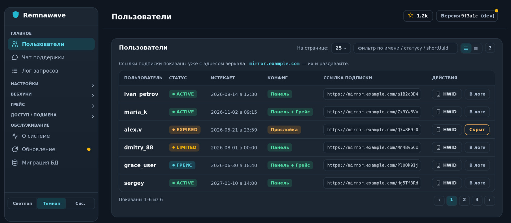
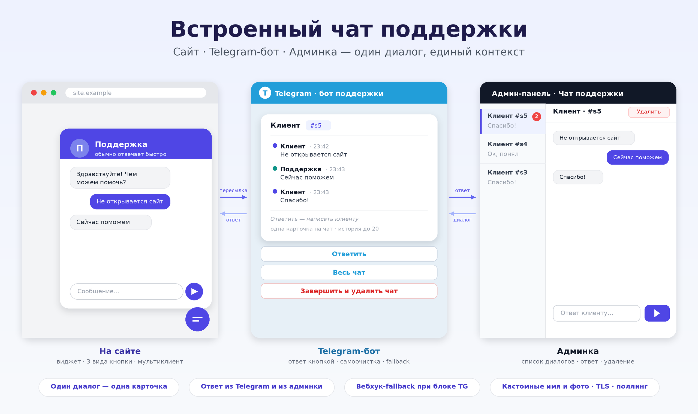

# Remnawave Subscription Middleware




Прослойка для подписок [Remnawave](https://remna.st): встаёт перед панелью и на лету правит выдачу подписки — заголовки под приложения, заглушки для заблокированных устройств, мягкое истечение («грейс-сквад»). Основной сценарий — зеркало для России: клиент ходит на ваш РФ-домен, а прослойка проксирует запрос на origin-домен панели. В комплекте — веб-админка поверх API панели и пересылка вебхуков на несколько адресов.

💬 **Чат проекта:** https://t.me/+GTkYbwX3alg0ZGEy

> [!WARNING]
> **Проект в стадии активной разработки (beta).** Возможны ошибки, часть поведения
> ещё обкатывается. Перед установкой сделайте бэкап панели.
>
> Из всех функций в живую панель пишет только функция «грейс-сквад» — и она по
> умолчанию выключена. Что именно и когда меняется — в разделе
> [«Может ли прослойка навредить»](#может-ли-прослойка-навредить-панели-и-пользователям).

---

## ⚡ Быстрый старт

Прослойка ставится перед панелью Remnawave. Два способа установки:

**Рядом с панелью (Docker, рекомендуется):**

```bash
sudo apt update && sudo apt install -y git
sudo git clone https://github.com/Mrvibecodic/remnawave-subscription-middleware \
    /opt/remnawave-subscription-middleware
cd /opt/remnawave-subscription-middleware
sudo bash install.sh        # выбрать «2) Рядом с панелью — Docker»
```

**Отдельный сервер (файлами):** те же команды, но в `install.sh` выберите «1) Отдельный сервер».

Отдельный сервер можно поднять и на Docker — образ универсальный: запустите контейнер своим `docker-compose` (TLS и домен — внешним reverse-proxy перед ним) и в мастере админки выберите режим «зеркало». Через `install.sh` этот путь не ставится — только вручную.

Дальше откройте `https://<домен>/admin/` и пройдите мастер первого запуска. Подробно — раздел [Установка](#установка) и пошаговый [INSTALL.md](INSTALL.md).

> [!TIP]
> Адрес админки — со слешем на конце: `https://<домен>/admin/`.

Прослойка работает в двух режимах:

- **Зеркало** — проксирует домен подписки панели (основной РФ-сценарий).
- **Основная подписка** — сама отдаёт конфиги с `/api/sub` и рисует страницу подписки.

---

## Содержание

- [Зачем это нужно](#зачем-это-нужно)
- [Возможности](#возможности)
- [Установка](#установка)
- [Установка на шаред-хостинг (FastPanel и другие панели)](#установка-на-шаред-хостинг-fastpanel-и-другие-панели)
- [О скрипте установки (стек и ресурсы)](#о-скрипте-установки-стек-и-ресурсы)
- [SQLite или MySQL/MariaDB — что выбрать](#sqlite-или-mysqlmariadb--что-выбрать)
- [Смена БД на лету (SQLite ↔ MySQL)](#смена-бд-на-лету-sqlite--mysql)
- [Обновление прослойки](#обновление-прослойки)
- [Защищённый канал подписки (Clod Clash)](#защищённый-канал-подписки-clod-clash)
- [Может ли прослойка навредить панели и пользователям](#может-ли-прослойка-навредить-панели-и-пользователям)
- [Права API-токена](#права-api-токена)
- [Требования](#требования)
- [Совместимость с версиями панели](#совместимость-с-версиями-панели)

---

## Зачем это нужно

Панель Remnawave обычно живёт на зарубежном origin за Cloudflare. Из России
такой адрес часто открывается нестабильно, и **подписки у клиентов перестают
обновляться** — приложение не может достучаться до origin. Прослойка решает это:
клиент ходит на РФ-зеркало, а уже зеркало со своей стороны проксирует запрос на
origin (часто доступный с сервера, даже если у клиента он заблокирован).

Попутно прослойка добавляет удобства на стороне зеркала: точечную блокировку
устройств с понятным сообщением, «грейс» вместо жёсткого отключения,
переопределение заголовков под конкретные клиенты и единое окно для саппорта.

---

## Возможности

Прослойка не заменяет панель — она стоит **перед** ней и берёт на себя то, что удобнее делать на стороне РФ-зеркала.

- **Зеркало подписок** — проксирует запросы подписки с РФ-домена на origin панели. Надёжное обновление подписок у клиентов из России.
- **Грейс-сквад для истёкших** — вместо жёсткого отключения переносит истёкшего в ограниченный сквад на заданный срок и возвращает обратно при оплате. По умолчанию выключено.
- **HWID-блокировка устройств** — точечно блокирует конкретное устройство по его HWID: оно видит заглушку с вашим текстом вместо конфига. Просмотр и удаление устройств — из админки.
- **HWID из User-Agent** — для клиентов, которые не умеют слать HTTP-заголовки, но позволяют менять User-Agent (v2rayNG, Clash): прослойка берёт данные об устройстве из строки User-Agent.
- **Лог запросов** — кто, когда и каким клиентом обновлял подписку: решение прослойки, тип ответа, размер тела, модель и ОС устройства (из заголовков клиента, а если их нет — из User-Agent), фильтры и раскрытие строки в карточку.
- **Правила ответа по приложению** — подмена заголовков подписки под конкретный клиент (profile-title, announce, интервал обновления и т.д.) по User-Agent и ОС.
- **Доп. конфиги по сквадам (бета)** — добавляет в подписку конфиги WireGuard / AmneziaWG / VLESS по внутреннему скваду, подстраивая формат под клиент. У VLESS поддержаны транспорты raw/tcp, ws, httpupgrade, grpc, h2, xhttp, mKCP и QUIC, а также Reality, Vision и http-обфускация. Поддержка у клиентских ядер разная (например, xhttp нет в sing-box, а QUIC — в Xray): в админке у каждого конфига видно, каким клиентам он уйдёт, и несовместимому ядру он не отдаётся — вместо порчи всей подписки пропускается только этот конфиг. Заблокированному, истёкшему, исчерпавшему трафик и упёршемуся в лимит устройств ничего не подмешивается — статус сверяется с панелью.
- **Пул WG/AWG-конфигов (бета)** — раздаёт готовые `.conf` из загруженного пула, закрепляя за подписчиком или устройством отдельный конфиг (один WG-ключ нельзя делить между устройствами).
- **Слияние двух подписок** — узлы второй подписки подмешиваются в тело основной: клиент получает одну ссылку, серверы из обеих лежат вместе.
- **Обновление с GitHub** — встроенное обновление по коммитам: тянет только изменённые файлы, делает бэкап с откатом. Пункт меню подсвечивается, когда есть что обновить.
- **Пересылка вебхуков (тройник)** — входящий вебхук панели можно разослать на несколько адресов, переподписав каждого его секретом.
- **Веб-админка** поверх API панели: пользователи со ссылками подписки, устройства HWID, оверрайды, логи, брендинг. Настройки сохраняются автоматически.
- **Брендинг автоматически** подтягивается из панели (имя и логотип), с ручным переопределением при необходимости.
- **Маскировка с выбором дизайна** — на не-подписочные запросы отдаётся нейтральная страница входа вместо голого прокси; её вид выбирается в «Брендинге».
- **Чат поддержки на странице-заглушке** — встроенный чат с переотправкой в Telegram и вебхук-fallback; оператор отвечает из админки, Telegram или вебхуком.
- **Защищённый канал подписки** — подписка забирается по адресу, в котором нет ничего читаемого, а ответ приходит сплошным шифротекстом одного размера. Посредник, который терминирует TLS, не видит ни адреса подписки, ни карточки устройства, ни заголовков ответа, ни тела. Работает только с клиентами [Clod Clash](https://github.com/Mrvibecodic/clod-clash) и [Clod Clash для Android](https://github.com/Mrvibecodic/clod-clash-android), включается пользователем для отдельной подписки, по умолчанию выключено — подробности в [docs/chan.md](docs/chan.md).
- **Мониторинг нагрузки** — вкладка «О системе»: версия PHP/ОС/БД, график запросов (отделяет реальные обновления подписки от сканеров), детектор аномальных пиков.



---

## Установка

Три способа установки (первые два ставит `install.sh`, третий — вручную):

1. **Рядом с панелью, Docker (рекомендуется)** — контейнер прослойки встаёт перед контейнером `subscription-page` панели: на пути клиента добавляет свои функции, а саму страницу подписки в браузере проксирует на него же. Обновление — одной командой `docker compose pull`.
2. **Отдельный сервер (файлами)** — классическое зеркало: nginx + PHP-FPM + TLS на своём домене, проксирование origin-домена подписки.
3. **Отдельный сервер на Docker (вручную)** — тот же образ, что в варианте 1, но запускается сам по себе на отдельном сервере. `install.sh` этот путь не ставит, настройка ручная (см. ниже).

> 📘 **Пошаговая инструкция — [INSTALL.md](INSTALL.md):** Docker-установка рядом с панелью (правка nginx панели, перевод домена подписки на прослойку) и установка на отдельный сервер. На эту же страницу ссылается вывод `install.sh`.

### Вариант 1. Рядом с панелью (Docker)

Панель и её reverse-proxy уже работают, домен подписки обслуживает контейнер `subscription-page`. Прослойка встаёт **перед** ним:

```bash
sudo apt update && sudo apt install -y git
sudo git clone https://github.com/Mrvibecodic/remnawave-subscription-middleware \
    /opt/remnawave-subscription-middleware
cd /opt/remnawave-subscription-middleware
sudo bash install.sh        # выбрать «2) Рядом с панелью — Docker»
```

Установщик спросит домен подписки, имя docker-сети панели, внутренние URL панели и контейнера `subscription-page`, тег образа (`v1` — стабильный релиз, по умолчанию; `dev` — тестовый; см. [docs/docker-image-tag.md](docs/docker-image-tag.md)), создаст `docker-compose.yml`, скачает образ из GHCR и поднимет контейнер. Останется одной строкой в nginx панели перевести домен подписки с контейнера `subscription-page` на прослойку — все шаги в **[INSTALL.md](INSTALL.md)**. Контейнер `subscription-page` останавливать не нужно; данные (`config.php`, БД) живут в volume и переживают `docker pull`.

### Вариант 2. Отдельный сервер (файлами)

На чистом **сервере** (Ubuntu 22.04+/Debian 12+) ставится **актуальный nginx (из официального репозитория nginx.org) +
PHP-FPM + SQLite** (по умолчанию; опционально MySQL/MariaDB). Клонируйте репозиторий в `/opt` и запустите
установщик:

> [!IMPORTANT]
> Этот вариант рассчитан на **чистый сервер**. nginx ставится из репозитория
> nginx.org, поэтому если на сервере **уже стоит nginx**, установщик предложит
> сначала удалить его (вместе с каталогом `/etc/nginx`). Перед удалением он делает
> резервную копию `/etc/nginx` в `/root/` и спрашивает подтверждение дважды, но
> **другие сайты на этом nginx перестанут работать**. Если nginx уже обслуживает
> другие проекты — ставьте прослойку на отдельный сервер или вручную (см. раздел
> про шаред-хостинг).

```bash
sudo apt update && sudo apt install -y git
sudo git clone https://github.com/Mrvibecodic/remnawave-subscription-middleware \
    /opt/remnawave-subscription-middleware
cd /opt/remnawave-subscription-middleware
sudo bash install.sh        # выбрать «1) Отдельный сервер»
```

На минимальных образах Ubuntu/Debian git не предустановлен — первая строка ставит
его. Папку создавать не нужно — `git clone` создаёт её сам; `sudo` обязателен,
потому что запись в `/opt` доступна только root.

Установщик сам:

- доставит зависимости, если их нет (актуальный nginx из nginx.org, php-fpm, php-sqlite3, php-mysql, certbot);
- создаст БД (SQLite-файл или MariaDB — по выбору);
- развернёт файлы в `/opt/remnawave-subscription-middleware`;
- выпустит TLS-сертификат;
- пропишет **полный конфиг nginx**: вебхук `/webhook.php`, обработку запросов
  подписки, отдачу статики, редирект 80→443 и закрытие служебных файлов
  (`config.php`, `lib/`, `schema.sql` и т.п.) — всё прямо в nginx, потому что на
  чистом nginx `.htaccess` не работает.

Скрипт спросит:

- **домен прослойки** — он же домен зеркала подписок (один домен);
- **origin-домен** подписки панели (напр. `sub.example.com`);
- **тип БД**: SQLite (по умолчанию — ничего не ставится) или MySQL/MariaDB
  (установщик сам поставит лёгкую MariaDB и создаст базу со случайными именем,
  пользователем и паролем);
- **способ выпуска сертификата** на выбор:
  - **HTTP-01** — валидация по 80 порту (порт должен быть открыт извне);
  - **Cloudflare DNS API** — без открытия портов (на выбор: API Token с правами Zone.DNS: Edit, либо Global API Key + email аккаунта);
- e-mail для Let's Encrypt.

Домены и параметры БД установщик кладёт во временный `data/install.json`, и
PHP-мастер подставляет их сам — повторно вводить не нужно (после установки файл
удаляется).

После установки откройте `https://<домен>/admin/`, пройдите мастер (данные БД
печатает установщик), задайте URL панели + API-токен и секрет вебхука, затем
пропишите `https://<домен>/webhook.php` в `.env` панели Remnawave.

### Вариант 3. Отдельный сервер на Docker (вручную)

Образ универсальный, поэтому отдельный сервер можно поднять и на Docker. `install.sh`
этот путь не ставит — настройка ручная:

- запустите контейнер своим `docker-compose` (за основу — `docker-compose.example.yml`),
  **без** подключения к docker-сети панели;
- TLS и домен зеркала — на внешнем reverse-proxy перед контейнером (nginx/Caddy на хосте);
- панель укажите по публичному `https://`-адресу, а не по внутреннему имени контейнера;
- откройте `https://<домен>/admin/` и в мастере выберите режим **«зеркало»**, задав
  origin-домен подписки.

Подходит, если хочется единообразного Docker-развёртывания. Для типичного отдельного
сервера проще «Вариант 2» (файлами) — он сам ставит nginx + TLS.

### Сертификат

Один домен — один сертификат, без wildcard. Способ на выбор при установке:
HTTP-01 (`certbot --webroot`, по 80 порту) либо Cloudflare DNS
(`certbot --dns-cloudflare`, без открытия портов). Автопродление настраивает сам
certbot (systemd-таймер); при продлении сертификата nginx автоматически
перезагружается, чтобы подхватить новый (`--deploy-hook "systemctl reload nginx"`).

## Установка на шаред-хостинг (FastPanel и другие панели)

Прослойка — обычное PHP-приложение без демонов и cron, поэтому работает и на
шаред-хостинге с панелью управления (FastPanel, ISPmanager, Hestia, cPanel и т.п.).
Нужен PHP 8.1+ (`pdo_sqlite`/`pdo_mysql`, `curl`, `mbstring`) и Apache с `.htaccess`.

Создайте сайт на домене зеркала с TLS, залейте файлы репозитория в корень и откройте
`https://<домен>/admin/` — мастер спросит остальное. Важное для прослойки:

- Скрытый `.htaccess` должен загрузиться (файловые менеджеры часто прячут dot-файлы) —
  без него не закроются служебные пути.
- Каталог `data/` — доступен PHP на запись (обычно так и есть).
- После мастера пропишите `https://<домен>/webhook.php` в `.env` панели.
- Проверьте, что `/config.php`, `/data/`, `/lib/` отдают 403/404; иначе включите
  `.htaccess` (`AllowOverride`) в панели.

Обновляется прямо из админки («Обслуживание → Обновление») — git на хостинге не нужен.

## О скрипте установки (стек и ресурсы)

**Стек:** актуальный nginx (из nginx.org) + PHP-FPM (режим `ondemand`) + SQLite (по умолчанию) или MySQL/MariaDB. Отдельный сервер БД для SQLite не нужен.

В простое почти не ест ресурсы (`pm=ondemand` поднимает воркеры только на запрос) —
хватает слабого VPS (1 vCPU / 512 МБ–1 ГБ). Под нагрузкой каждый запрос подписки
занимает один воркер на время проксирования; дефолтных 8 хватает на десятки
запросов/сек.

SQLite комфортна примерно до 1–2 тыс. пользователей. Узкое место — высокая
одновременная запись: если упрётесь, переходите на MySQL/MariaDB (вкладка «Миграция
БД»). Логи режутся автоматически, поэтому файл БД не разрастается бесконтрольно.

## SQLite или MySQL/MariaDB — что выбрать

| | SQLite (по умолчанию) | MySQL / MariaDB |
|---|---|---|
| Установка | ничего — файл, встроено в PHP | отдельный сервер БД (`apt install mariadb-server`) |
| RAM в простое | ~0 (внутри процесса PHP) | ~80–150 МБ постоянно (демон БД) |
| Одновременная запись | сериализуется: один писатель за раз (WAL смягчает) | много писателей параллельно |
| Чтение | очень быстрое | быстрое |
| Бэкап | копия файла `data/submw.sqlite` | `mysqldump` |
| Подходящая нагрузка | малый/средний сервис (ориентир — до ~1–2 тыс. пользователей) | крупный сервис, высокая плотная запись |
| Когда брать | по умолчанию: проще, легче, без зависимостей | если упёрлись в одновременную запись или большой объём |

Сменить базу можно в любой момент из админки — вкладка «Миграция БД» (в обе стороны).

## Смена БД на лету (SQLite ↔ MySQL)

Вкладка **«Миграция БД»** переносит все таблицы в другую базу и переключает прослойку
на неё — в обе стороны (SQLite ↔ MySQL). Перед миграцией сделайте бэкап; `config.php`
обновляется сам.

## Обновление прослойки

**Через админку** («Обслуживание → Обновление»): при первом заходе нажмите «Отметить
текущую версию». Дальше прослойка сама проверяет ветку и подсвечивает пункт меню,
когда выходят новые версии; кнопка «Обновить» тянет только изменённые файлы, с
бэкапом и откатом. `config.php`, `.git` и `.backups/` не перезаписываются.

**В Docker** обновление идёт через образ:

```bash
cd /opt/remnawave
docker compose pull && docker compose up -d
```

Тег `v1` — стабильные релизы, `latest` — ветка `main`, `dev` — тестовый. Перед обновлением
проверьте тег в `docker-compose.yml` — `pull` тянет именно его. Данные в volume не
теряются.

**Вручную с сервера** (установка из git):

```bash
cd /opt/remnawave-subscription-middleware
git fetch origin && git reset --hard origin/main
sudo systemctl reload php*-fpm 2>/dev/null || true
```

После — отметьте текущую версию в админке.

## Защищённый канал подписки (Clod Clash)

Обычная подписка ходит через CDN или другого посредника, который терминирует TLS. Для него запрос открыт: он видит адрес подписки вместе с токеном, заголовки устройства, заголовки ответа со сроком и трафиком и само тело со списком серверов. Защищённый канал закрывает ровно это.

Запрос уходит по адресу вида `/c1/<метка>/<отпечаток>/<блок>`, где метка меняется каждые сутки, а всё остальное зашифровано. Общий секрет — сам адрес подписки, и в сеть он не уходит ни разу: из него выводится ключ. Ответ приходит сплошным шифротекстом, дополненным до одного размера, с кодом 200 и двумя нейтральными заголовками; настоящий код, заголовки панели и тело едут внутри.

**Работает только с двумя клиентами** — [Clod Clash](https://github.com/Mrvibecodic/clod-clash) и [Clod Clash для Android](https://github.com/Mrvibecodic/clod-clash-android). Это протокол этих приложений и прослойки, а не стандарт подписок: другие клиенты про него не знают.

Канал — свойство запроса, а не пользователя: обычные подписки идут прежним путём, их обработка не меняется ни строкой. Галочку «Защищённое соединение» ставит сам пользователь для отдельной подписки, главный тумблер в админке по умолчанию выключен, откат — выключить его обратно.

Нужен PHP с расширением `sodium`; без него канал выключен принудительно, а остальное работает как обычно. Управление — вкладка **«Защищённый канал»**: готовность, тумблеры, отпечаток ключа со сменой, список подписок с жёстким режимом и диагностический журнал.

Устройство протокола, порядок включения, жёсткий режим, ротация ключа и диагностика — **[docs/chan.md](docs/chan.md)**.

---

## Может ли прослойка навредить панели и пользователям

**По умолчанию прослойка панель не изменяет** — только читает (пользователи,
устройства, брендинг) и проксирует подписки. В живую панель пишут лишь две вещи:

- **Грейс-сквад** (по умолчанию выключен). При включении на событие `user.expired`
  меняет у пользователя сквады, лимиты и дату истечения, а при оплате возвращает
  обратно. Самый рискованный компонент: снимок исходного состояния хранится в таблице
  `grace_users` — без неё корректный возврат невозможен. Включайте после проверки на
  тестовом пользователе и держите бэкап.
- **Удаление устройства (HWID)** — только по ручному клику в админке.

Кроме того: API-токен открывает доступ к API панели — держите его в секрете и
ограничьте доступ к админке. С **Remnawave 2.8.0** токен можно выпустить с
ограниченными правами — рекомендуем дать прослойке только нужный минимум, а не полный
доступ. Точный список — в разделе [Права API-токена](#права-api-токена).

## Права API-токена

Начиная с **Remnawave 2.8.0** у API-токена есть области доступа (scopes) вида
`ресурс:действие`. Прослойке полный доступ не нужен — ниже точный минимум.

Набор прав **одинаков для панелей 2.8.0+ и 3.x** — имена областей между версиями не
менялись. Единственное отличие: `system:configuration` появился только в 3.2.0 —
на панелях 2.8.x — 3.1.x такой области нет, и её надо просто не выдавать. На панелях
**2.7.4 — 2.7.x** областей ещё не было: там токен всегда полнодоступный, и
настраивать нечего.

### Где выдавать права в панели

Панель → сайдбар **«Настройки»** → **«Настройки Remnawave»**
(`/dashboard/management/settings`) → карточка **«API токены»** → **«Создать API
токен»**.

В окне создания — список ресурсов (Users, Hwid User Devices, Internal Squads,
External Squads, System, Nodes и т. д.). У каждого ресурса два переключателя
**Read** и **Write** (подписи латиницей), а если раскрыть ресурс — можно отметить
отдельные эндпоинты. Готовые пресеты сверху («Read only», «Полные права»,
«Subpage») прослойке не подходят — они либо дают лишнее, либо не то.

Как панель понимает права (от широкого к узкому): `*` → `ресурс:*` →
`ресурс:read` / `ресурс:write` → `ресурс:конкретный-эндпоинт`. Достаточно
совпадения на любом уровне.

> Токен показывается **один раз** сразу после создания — скопируйте его в поле
> «API-токен» на вкладке «Подключение» в админке прослойки.

### Готовый набор для вставки

В окне создания токена внизу есть иконка буфера обмена с подсказкой **«Вставить»** —
она принимает JSON-массив областей и сама расставляет галочки. Панель должна быть
открыта по `https://`, иначе браузер не даст прочитать буфер. Области, которых нет в
вашей версии панели, просто игнорируются.

Полный набор — все функции прослойки работают:

```json
[
  "users:list",
  "users:by-short-uuid",
  "users:by-username",
  "users:update",
  "users:reset-traffic",
  "hwid-user-devices:list",
  "hwid-user-devices:list-by-user",
  "hwid-user-devices:delete",
  "internal-squads:list",
  "external-squads:list",
  "system:metadata",
  "system:configuration",
  "system:stats",
  "nodes:list"
]
```

Только чтение — панель не изменяется вообще (не работают грейс-сквад и кнопка
удаления устройства):

```json
[
  "users:list",
  "users:by-short-uuid",
  "users:by-username",
  "hwid-user-devices:list",
  "hwid-user-devices:list-by-user",
  "internal-squads:list",
  "external-squads:list",
  "system:metadata",
  "system:configuration",
  "system:stats",
  "nodes:list"
]
```

Не хочется возиться с отдельными эндпоинтами — можно выдать по ресурсам целиком:
`users:read`, `users:write`, `hwid-user-devices:read`, `hwid-user-devices:write`,
`internal-squads:read`, `external-squads:read`, `system:read`, `nodes:read`. Прав
будет больше необходимого, но записывать токен сможет только в пользователей и
устройства.

### Что нужно каждому разделу прослойки

| Раздел прослойки | Права |
|---|---|
| Шапка админки, «О системе» → «Панель» | `system:metadata` **(нужен всегда)** |
| «О системе» → статистика панели | `system:stats`, `nodes:list` |
| «Подключение», «Вебхуки», «Лог запросов» (длина shortUuid) | `system:configuration` *(панель 3.2.0+)* |
| «Пользователи» — список | `users:list` |
| «Пользователи» — устройства пользователя | `hwid-user-devices:list-by-user` |
| «Пользователи» — кнопка «удалить устройство» | `hwid-user-devices:delete` **(запись)** |
| «Оверрайды», «Лог запросов» — подстановка имён | `users:list` |
| «Юзер-лог» (лог вебхуков) — подстановка имён | `users:by-short-uuid` |
| **«Грейс-сквад» и «Грейс-юзеры»** | `users:by-short-uuid`, `users:update` **(запись)**, `internal-squads:list`, `external-squads:list`; плюс `users:reset-traffic` **(запись)**, если задан лимит трафика грейса |
| «Доп. конфиги» | `users:by-short-uuid`, `internal-squads:list`, `hwid-user-devices:list-by-user` |
| «WG / AWG конфиги» | `users:list`, `users:by-short-uuid`, `users:by-username`, `internal-squads:list`, `hwid-user-devices:list`, `hwid-user-devices:list-by-user` |
| «Слияние подписок» | `users:by-short-uuid`, `users:by-username` |
| «Брендинг» | прав не нужно — см. примечания |
| Проксирование подписки (обе схемы) | прав не нужно — см. примечания |

### Полный список эндпоинтов панели

Всё, что прослойка вообще запрашивает у панели:

| Эндпоинт | Метод | Область | Тип | Зачем |
|---|---|---|---|---|
| `/api/users` | GET | `users:list` | read | список пользователей (постранично) |
| `/api/users/by-short-uuid/{shortUuid}` | GET | `users:by-short-uuid` | read | пользователь по ссылке подписки |
| `/api/users/by-username/{username}` | GET | `users:by-username` | read | поиск по имени |
| `/api/users` | PATCH | `users:update` | **write** | грейс-сквад: перевод в грейс и возврат обратно |
| `/api/users/{userId}/actions/reset-traffic` | POST | `users:reset-traffic` | **write** | грейс-сквад: сброс трафика на входе в грейс |
| `/api/hwid/devices` | GET | `hwid-user-devices:list` | read | подсчёт устройств для WG-пула |
| `/api/hwid/devices/{userId}` | GET | `hwid-user-devices:list-by-user` | read | устройства пользователя |
| `/api/hwid/devices/delete` | POST | `hwid-user-devices:delete` | **write** | удаление устройства по клику в админке |
| `/api/internal-squads` | GET | `internal-squads:list` | read | списки сквадов в настройках |
| `/api/external-squads` | GET | `external-squads:list` | read | внешний сквад для грейса |
| `/api/system/metadata` | GET | `system:metadata` | read | версия панели |
| `/api/system/configuration` | GET | `system:configuration` | read | настройки панели *(3.2.0+)* |
| `/api/system/stats` | GET | `system:stats` | read | статистика на «О системе» |
| `/api/nodes` | GET | `nodes:list` | read | счётчик нод на «О системе» |
| `/api/sub/{shortUuid}` | GET | — | — | публичный, токен не используется |
| `/api/auth/status` | GET | — | — | публичный, токен не используется |

В путях `{userId}` — это идентификатор **пользователя**: `uuid` на панели 2.x и
числовой `id` на 3.x. Прослойка подставляет нужный сама, исходя из версии панели.

### Примечания

- **`system:metadata` нужен всегда.** По версии панели прослойка выбирает, чем
  адресовать пользователя — `uuid` (панель 2.x) или числовой `id` (3.x). Без этого
  права ломаются грейс и часть операций с пользователями.
- **`/api/sub/{shortUuid}` — публичный эндпоинт**, авторизация не нужна. Он
  используется, когда на вкладке «Подключение» выбран источник подписки «Панель».
  В режиме «Зеркало» прослойка ходит на origin-домен и API панели тут вообще не
  задействован.
- **Брендинг.** Имя сервиса и логотип берутся из публичного `/api/auth/status` —
  права не нужны. Резервный источник `/api/remnawave-settings` в панели 3.x
  доступен **только админскому JWT**, API-токену — нет; если оттуда ничего не
  пришло, задайте имя и логотип вручную во вкладке «Брендинг».
- **`system:configuration` появился в панели 3.2.0.** На более старых панелях
  эндпоинта нет, прослойка его не запрашивает, и это право можно не выдавать. Если
  создаёте токен не через окно панели, а запросом к API, — на 2.8.x — 3.1.x уберите
  эту строку из массива, иначе панель отклонит весь запрос целиком.
- **Слияние подписок и проксирование** ходят за второй подпиской и за origin-домен
  без токена — правами это не регулируется.
- **Панели 2.7.4 — 2.7.x** областей не поддерживают — там токен всегда полнодоступный,
  раздел к ним не применяется. Поддержка этих версий прослойкой сохраняется.
- Если какого-то права не хватает, панель ответит `403`, а прослойка покажет
  ошибку в соответствующем разделе; на проксирование подписок это не влияет.

## Требования

- Сервер на Ubuntu 22.04+/Debian 12+ (root/sudo). Подходит слабый VPS — или
  шаред-хостинг с PHP 8.1+ (см. раздел про шаред-хостинг).
- БД — SQLite (файл), отдельный сервер БД не нужен.
- Домен в Cloudflare — только если выбираете сертификат через Cloudflare DNS (для HTTP-01 не требуется).
- Доступ к панели Remnawave: URL и API-токен (для админки), секрет вебхука.

## Совместимость с версиями панели

Поддерживаются **Remnawave 2.7.4+ и 3.x** — одна и та же версия прослойки работает
с обеими, переключать ничего не нужно.

Панель 3.0 убрала у пользователя поле `uuid` и перевела все пути и тела запросов на
числовой `id`. Прослойка определяет это по самому ответу панели: есть `uuid` —
работает по нему, нет — по `id`. Порядок обновления любой: можно сначала обновить
панель, можно прослойку.

Записи пользователей, ушедших в грейс **до** обновления панели, чинятся сами при
первом же обращении — сохранённый идентификатор перезапрашивается по `shortUuid`.
Пересчитать всё разом можно кнопкой «Обновить идентификаторы» во вкладке «Подмена».

Версия панели видна в шапке админки рядом с версией прослойки и в разделе
«Система» → «Панель» (источник — `GET /api/system/metadata`).

Панель 3.2.0 добавила `GET /api/system/configuration` — собственные настройки
панели в виде ответа API. Прослойка запрашивает его только на 3.2.0 и выше,
кеширует на 10 минут и использует по мелочи: подсказывает домен подписки во
вкладке «Подключение», показывает во вкладке «Вебхуки», включены ли они на
стороне панели, и знает длину `shortUuid` — на ней держится необязательное
правило отсева сканеров в «Логе запросов». Все значения целиком видны в
«Система» → «Панель» → «Конфигурация панели». На панелях ниже 3.2.0 запроса нет,
всё работает как прежде.

Ещё два момента по панели 3.0:

- настройки подписки `profileTitle`, `profileUpdateInterval`, `supportLink`,
  `isProfileWebpageUrlEnabled`, `happAnnounce`, `happRouting` переехали в кастомные
  заголовки панели (`profile-title`, `profile-update-interval`, `support-url`,
  `profile-web-page-url`, `announce`, `routing`) и теперь уходят **всем** клиентам,
  а не только Happ. На вкладке «Заголовки» они появятся в колонке «из панели»;
- панель больше не сжимает тело ответа — сжатие должен делать реверс-прокси.
  В конфиге, который печатает `install.sh`, `gzip on` уже включён; если ставили
  вручную, проверьте, что `gzip_types` покрывает `text/plain` и yaml.

---

💬 **Чат проекта:** https://t.me/+GTkYbwX3alg0ZGEy
